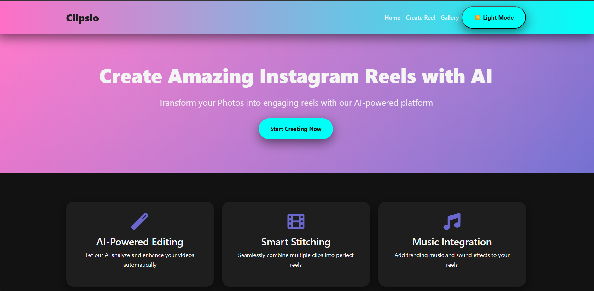
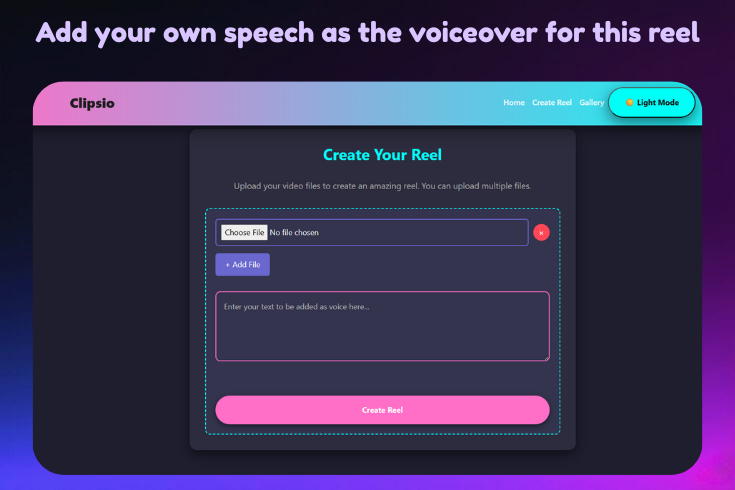
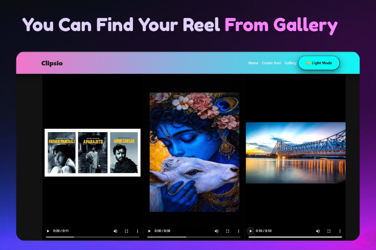

# Clipsi AI 🎥🗣️  
> **AI-powered Reel Creator** — Turn your images into engaging reels with realistic voiceovers.


---

## 📌 Overview
**Clipsi AI** is a full-fledged Python-based web application that converts a set of uploaded images into a short video reel.  
Simply upload your images, provide a prompt, and the system will:
1. Convert your prompt into speech using **ElevenLabs API**.
2. Merge the images into a reel-style video with **FFmpeg**.
3. Add the generated speech as the reel's background audio.



This makes it ideal for **social media creators, storytellers, and marketers** who want quick, automated, and visually engaging content.

---

## 🚀 Features
- 📸 Upload multiple images to create a reel.
- 📝 Provide a custom text prompt for narration.
- 🎙️ Generate realistic speech from text using **ElevenLabs AI**.
- 🎬 Merge images and audio into a smooth reel using **FFmpeg**.
- 🌐 Simple and intuitive **Flask**-based web interface.
- 🎨 Frontend designed with **HTML & CSS** for clean and responsive UI.


---

## **🚀 Live Preview**
https://clipsi-ai-znqi.onrender.com
## 🛠️ Tech Stack
**Backend:** Python, Flask  
**Frontend:** HTML, CSS  
**Media Processing:** FFmpeg  
**AI Services:** ElevenLabs API (Text-to-Speech)  

---

## 📂 Project Structure
ClipsiAI/
│
├── app.py # Flask backend

├── templates/ # HTML templates
│ ├── index.html
│ └── result.html


├── static/ # CSS & assets
│ └── style.css
├── uploads/ # Uploaded images
├── output/ # Generated video reels

├── requirements.txt # Python dependencies
└── README.md
---

## ⚙️ Installation & Setup

### 1️⃣ Clone the repository
```bash
git clone https://github.com/your-username/clipsi-ai.git
cd clipsi-ai

pip install -r requirements.txt
3️⃣ Install FFmpeg
Windows: Download from FFmpeg.org and add to PATH.

Linux (Ubuntu/Debian):

bash
Copy
Edit
sudo apt update && sudo apt install ffmpeg
4️⃣ Set up ElevenLabs API Key
Create a .env file in the project root:

env
Copy
Edit
ELEVENLABS_API_KEY=your_api_key_here
5️⃣ Run the application
bash
Copy
Edit
python app.py

🎯 Usage
Upload your images in the web form.

Enter a descriptive prompt (narration for the reel).

Click Generate Reel.

Wait for the processing to complete.

Download or preview your reel directly from the browser.

📌 Future Improvements
Add music track selection.

Support video uploads alongside images.

Enable multiple voice options.

Drag-and-drop image arrangement.

🤝 Contributing
Contributions are welcome!

Fork the repo

Create a new branch (feature/your-feature)

Commit changes

Open a Pull Request
For queries or collaborations: arkobhattacharyya05@gmail.com

